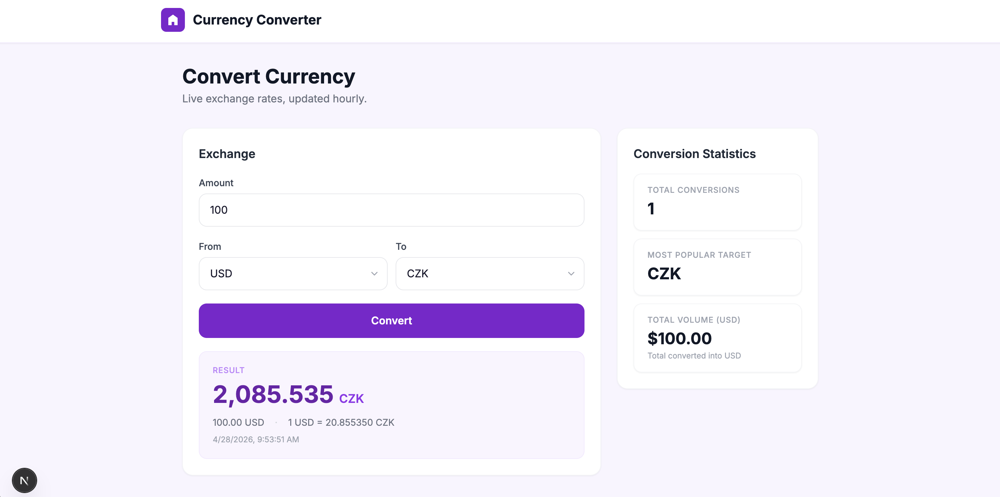
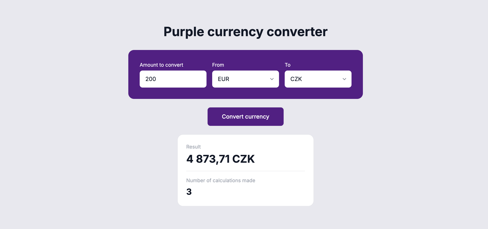

# AI collaboration diary

## 1. Vytvoření implementačního zadání pro AI agenta

Na začátku jsem pracoval s ChatGPT. Do chatu jsem vložil zadání case study a požádal jsem ho, aby mi z něj vytvořil implementační dokument pro AI agenta. Cílem bylo získat praktický soubor, podle kterého by mohl další nástroj postupně implementovat projekt.

Použitý prompt:

```text
Use this document to generate a Markdown file named AGENTS.md, the file will be used as implementation instructions for AI agents working on this feature. Focus specifically on Level 2 of the assignment. Use the following technology stack: Next.js, TypeScript, PostgreSQL, Prisma for persistence, Zod for validation. The output should be practical and implementation focused. Avoid unnecessary future vision, diary style notes, or nonessential planning sections.
```

Výsledkem byl soubor `AGENTS.md`, který sloužil jako implementační „kuchařka“ pro Claude Code. Tento krok fungoval dobře, protože mi pomohl převést obecnější zadání case study do konkrétních technických instrukcí. Dokument obsahoval technologický stack, rozsah implementace, doporučenou strukturu a pravidla pro validaci a práci s databází.

Zpětně jsem si ale uvědomil chybu v návrhu: celý projekt jsem na začátku směřoval jako jednu Next.js aplikaci. Později jsem vyhodnotil, že vhodnější je použít Next.js pouze jako prezentační frontend a API oddělit do samostatné Express vrstvy.

## 2. Použití AGENTS.md v Claude Code

Následně jsem použil vytvořený soubor `AGENTS.md` v Claude Code jako hlavní implementační specifikaci. Cílem bylo, aby Claude Code nejdříve pochopil zadání, strukturu projektu a až poté začal psát kód.

Použitý prompt:

```text
Use `AGENTS.md` as the primary implementation specification for setting up and implementing this project.

Before writing code:
1. Read `AGENTS.md` completely.
2. Understand the required architecture, data model, validation rules, and implementation scope.
3. Inspect the existing project structure before making changes.

Frontend implementation requirements:
- Use the provided Figma designs as the visual source of truth.
- Desktop design: https://www.figma.com/design/zTXL7qJjIisPe3j90YAjz0/Purple-case-study?node-id=0-2212&t=mexpsd8ECkYUeX2u-4
- Mobile design: https://www.figma.com/design/zTXL7qJjIisPe3j90YAjz0/Purple-case-study?node-id=0-2231&t=mexpsd8ECkYUeX2u-4
- Match the layout, spacing, typography, colors, and responsive behavior as closely as possible.
- Implement both desktop and mobile layouts.
- Create reusable components instead of building one large page component.
- Keep styling consistent and avoid hardcoded one-off values where design tokens or shared constants make sense.

Implementation expectations:
- Follow the technology stack and constraints defined in `AGENTS.md`.
- Keep the implementation practical and production-oriented.
- Use clear file organization and descriptive names.
- Add validation, error handling, and loading states where relevant.
- Do not add unrelated features beyond the scope defined in `AGENTS.md`.
- After implementation, run the relevant lint/typecheck/build commands and fix any issues.
- Summarize the completed work and mention any limitations or assumptions.
```

Tento prompt fungoval dobře hlavně proto, že obsahoval jasné kroky před samotným psaním kódu. Claude Code měl nejdříve přečíst specifikaci, pochopit architekturu a až potom provádět změny. Díky tomu nebyla implementace úplně náhodná a držela se původního zadání. 

## 3. Úpravy persistence a databázového modelu

Po základní implementaci následovalo několik menších úprav pomocí Claude Code. Jedna z nich se týkala ukládání kurzů měn. Původní řešení používalo in-memory cache, což nebylo ideální pro produkční řešení ani pro práci s databází.

Použitý prompt:

```text
Replace in-memory cache with postgres table for exchangeRates
```

Tento prompt fungoval dobře. Claude Code správně nahradil in-memory cache databázovou tabulkou v PostgreSQL a vytvořil odpovídající Prisma modely.

Při kontrole jsem si ale všiml problému v Prisma schématu. Modely byly sice vytvořené, ale nebyly namapované na databázové názvy ve stylu PostgreSQL. Například model `ExchangeRateCache` by měl v databázi odpovídat tabulce `exchange_rate_cache`. Chybělo tedy použití `@@map()` pro tabulky a `@map()` pro sloupce.

Proto jsem použil další prompt:

```text
Use Prisma model names in PascalCase and field names in camelCase. Map database table and column names to PostgreSQL style snake_case using @@map and @map in schema.prisma.
```

Tento prompt problém opravil. Prisma modely zůstaly čitelné v TypeScriptu, ale databázové tabulky a sloupce byly namapované podle běžnější PostgreSQL konvence.

Tady jsem musel AI výstup zkontrolovat a opravit směr. Samotná implementace databázové tabulky byla správná, ale konvence názvů nebyly dotažené.

## 4. Přesun logiky statistik do server-side komponenty

Další úprava se týkala Next.js stránky. Chtěl jsem, aby `page.tsx` fungovala jako server component a statistiky byly dostupné už při prvním renderu stránky. Klientská část měla zůstat pouze u formuláře pro samotnou konverzi.

Použitý prompt:

```text
Make page.tsx server component with getStats(), then add client wrapper for the form.
```

Cílem bylo oddělit serverovou a klientskou odpovědnost. Statistiky neměly být zbytečně načítané až na klientovi, zatímco interaktivní formulář měl zůstat jako client component. Tento krok pomohl lépe využít možnosti Next.js a zlepšit první načtení stránky.

## 5. Pokus o napojení na Figma MCP server

Na poprvé se mi nepovedlo přinutit agenta k tomu, aby frontend skutečně odpovídal Figma designu. Claude Code sice vytvořil poměrně přívětivý vlastní design, ale nebyl dostatečně přesný vůči zadanému návrhu.


Proto jsem zkusil přesnější prompt, kde jsem výslovně požadoval použití Figma MCP serveru jako zdroje pravdy.

Použitý prompt:

```text
Use the Figma MCP server as the visual source of truth and implement the frontend to match the provided Figma design as closely as possible.

Figma design:
desktop: https://www.figma.com/design/zTXL7qJjIisPe3j90YAjz0/Purple-case-study?node-id=0-2212&t=dL6DE26M9QDvjmC4-4
mobile:
https://www.figma.com/design/zTXL7qJjIisPe3j90YAjz0/Purple-case-study?node-id=0-2231&t=dL6DE26M9QDvjmC4-4

Goal:
Create a pixel-close frontend implementation based on the Figma design.

Technology stack:
- Next.js
- TypeScript
- Tailwind CSS
- React components

Instructions:
1. First inspect the Figma design through the Figma MCP server.
2. Identify the page structure, layout, spacing, typography, colors, components, breakpoints, and reusable design patterns.
3. Implement the frontend based directly on the Figma design, not by guessing.
4. Match the desktop and mobile layouts as closely as possible.
5. Use reusable components instead of one large page component.
6. Use Tailwind CSS for styling.
7. Extract repeated UI patterns into components.
8. Keep the implementation clean, typed, and maintainable.
9. Preserve visual hierarchy, spacing, border radius, shadows, colors, font sizes, and responsive behavior from the design.
10. Do not invent new sections, colors, layouts, or interactions unless required to make the page functional.
11. If assets/icons/images are present in Figma, export or reference them appropriately through the MCP workflow.
12. After implementation, review the result against the Figma design and adjust mismatches.

Implementation requirements:
- Use semantic HTML where possible.
- Keep components small and focused.
- Avoid hardcoded duplicated styles when a reusable component or Tailwind utility pattern makes sense.
- Ensure the page is responsive.
- Ensure there are no TypeScript or lint errors.
- Run the project checks after implementation.

Expected output:
- Fully implemented frontend matching the Figma design.
- Reusable component structure.
- Responsive desktop and mobile layout.
- No unnecessary placeholder content unless the Figma design itself contains placeholders.
```

Tento prompt byl detailní, ale v praxi narazil na technické omezení. Claude Code odpověděl, že se mu přes MCP server pravděpodobně nepodaří design správně použít. To byl moment, kdy jsem musel změnit přístup a nespoléhat se na Figma MCP.

## 6. Přechod z Figma MCP na screenshoty designu

Po neúspěchu s MCP serverem jsem zvolil jednodušší a praktičtější metodu. Místo přímého napojení na Figmu jsem Claude Code předal screenshoty desktopové a mobilní verze návrhu.

Použitý prompt:

```text
Instead of mcp server use images of figma design
```

K promptu jsem přiložil screenshoty desktop a mobile designu.

Tento přístup byl praktičtější. Agent nemusel řešit přístup k Figmě a mohl vizuálně vycházet přímo z obrázků. Výsledek pořád nebyl dokonale pixel-perfect, ale byl blíže původnímu designu než předchozí pokus.


## 7. Úprava result card a ruční zásah

Následně jsem potřeboval doladit několik menších UI detailů. Většinu z nich Claude Code provedl správně. Jeden z problémů se ale objevil u result card. Chtěl jsem, aby karta více odpovídala jednoduchému referenčnímu designu, měla border a horizontální oddělovače.

Použitý prompt:

```text
Update the result card UI to better match the provided simple design. 
Required changes:
- Add a border around the result card.
- Add horizontal separators between the conversion result and Number of calculations made.
- Adjust the result card spacing, layout, typography, and visual hierarchy so it matches the simple reference design more closely.

The current “Number of calculations made” in result box is wrong. It should display the number of calculation steps performed specifically while calculating the current conversion result.
```

Claude Code většinu požadavků pochopil a upravil. Problém ale nastal u bílého pozadí result card. Po odstranění bílého backgroundu začal border splývat s okolním pozadím, protože měl velmi podobnou barvu. Tento detail jsem nakonec raději upravil ručně.

Tady se ukázalo, že AI zvládne dobře strukturální změny, ale u jemných vizuálních detailů je stále potřeba lidská kontrola. Bez ručního zásahu by výsledek vizuálně nepůsobil správně.

## 8. Přehodnocení architektury a rozdělení projektu

Po další kontrole jsem přehodnotil původně zvolený stack a architekturu. Uvědomil jsem si, že vhodnější bude rozdělit systém na dvě vrstvy: samostatné API v Node.js Express a Next.js ponechat pouze jako prezentační vrstvu.

Použitý prompt:

```text
Split this system into 2 layers, create standalone api in nodejs express and use nextjs only as presentation layer.
```

Tento krok byl důležitý, protože opravil původní architektonické rozhodnutí. Místo jedné Next.js aplikace vznikla jasnější separace backendu a frontendu.

Následně jsem chtěl projekt fyzicky lépe uspořádat do složek, aby frontend a API byly oddělené na stejné úrovni.

Použitý prompt:

```text
Great now move all nextjs related files and folders to its own folder on same level as api.
```

Tím vznikla přehlednější struktura projektu, kde API a prezentační vrstva nejsou smíchané dohromady.

## 9. Dockerizace a aktualizace README

Po rozdělení projektu jsem potřeboval projekt připravit tak, aby šel jednoduše spustit a následně zveřejnit přes URL. Proto jsem nechal vytvořit Dockerfile a služby v `docker-compose`.

Použitý prompt:

```text
Update README to reflect splitted project, also add dockerfiles and services to docker compose.
```

Tento krok měl dvě části. První byla aktualizace dokumentace, aby odpovídala nové rozdělené architektuře. Druhá byla praktická příprava Docker konfigurace pro spuštění frontendu, API a databáze.

To mi pomohlo sjednotit spuštění projektu a udělat ho lépe předatelný.

## 10. Finální kontrola a hledání nekonzistencí

Na konci jsem použil kontrolní prompt, jehož cílem bylo odhalit chyby, nekonzistence nebo místa, kde frontend a API nejsou sladěné, zde jsem přešel na Codex z důvodu vyčerpání tokenů na Claude Code.

Použitý prompt:

```text
Do full review of app and api, try to expose any inconsitency
```

Tento prompt odhalil několik odchylek, které jsem následně nechal opravit. Šlo hlavně o kontrolu toho, jestli jsou API a frontend sladěné, jestli dokumentace odpovídá aktuálnímu stavu projektu a jestli po rozdělení aplikace nezůstaly někde staré nebo neplatné části.

Konkrétně jsme řešili tyto nekonzistence:
- **Docker/DB env:** API kontejner padal, protože Prisma uvnitř Dockeru používala `localhost` místo hostname služby `postgres`. Opravili jsme `docker-compose`, aby API dostávalo správné `DATABASE_URL` pro kontejnerovou síť (`postgres:5432`), zatímco lokální běh zůstává oddělený.
- **Bezpečnost chybových hlášek:** frontend zobrazoval serverové `message`, takže jsme na backendu sjednotili/sanitizovali veřejné chybové zprávy podle `error` kódů, aby se nevracely interní detaily.
- **Frontend validace kontraktů:** ruční type guardy jsme nahradili Zod schématy (`safeParse`) pro request/response validaci, aby frontend i API lépe držely stejný kontrakt.
- **Dokumentace vs realita:** upravili jsme README a `.env.example`, aby odpovídaly skutečnému spuštění po rozdělení projektu (API + web) a neobsahovaly neplatné předpoklady.

Tento poslední krok byl užitečný hlavně jako revize. AI zde nepůsobila jen jako generátor kódu, ale také jako nástroj pro kontrolu vlastního výstupu.

## Shrnutí spolupráce s AI

Nejlépe fungovaly prompty, které měly jasně definovaný kontext, konkrétní požadovaný výstup a omezení. Dobře fungovalo například vytvoření `AGENTS.md`, úprava Prisma mapování, nahrazení in-memory cache databázovou tabulkou nebo rozdělení projektu na API a frontend.

Naopak slabší výsledek byl u vizuální implementace podle Figmy. První pokus vedl spíše k vlastnímu designu než k přesné implementaci podle návrhu. Pokus přes Figma MCP server narazil na technické omezení, takže jsem musel změnit strategii a použít screenshoty. I potom bylo nutné některé vizuální detaily upravit ručně.

Během práce jsem musel několikrát AI výstup kontrolovat a korigovat. Nejvýraznější příklady byly špatně zvolená původní architektura v Next.js, chybějící mapování Prisma modelů na PostgreSQL konvence a vizuální problém s result card. AI tedy výrazně zrychlila implementaci, ale nefungovala jako plně samostatný vývojář bez kontroly. Nejlepší výsledky dávala ve chvíli, kdy jsem ji používal jako iterativního asistenta: zadat konkrétní krok, zkontrolovat výsledek, opravit směr a pokračovat dalším promptem.
